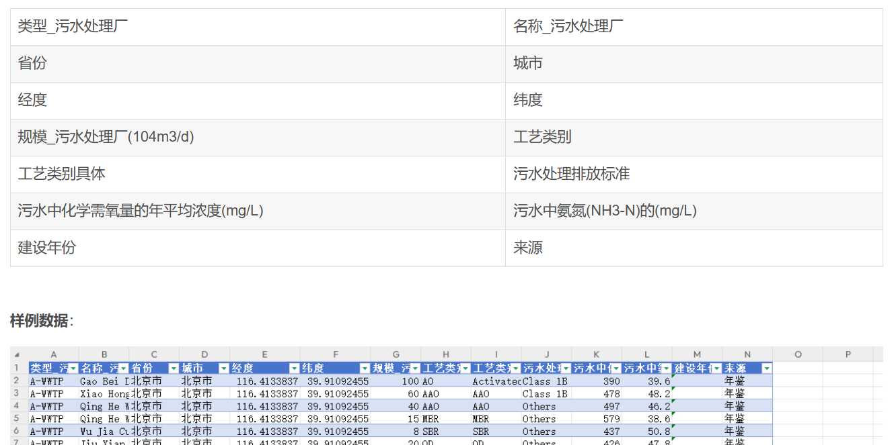

# China Sewage Treatment Plant Dataset - Up to 2024.xlsx

**Size:** 240KB XLSX

**Data Introduction:** The China Sewage Treatment Plant Dataset, encompassing 14 indicators including Type of Sewage Treatment Plant, Name of Sewage Treatment Plant, Province, City, Longitude, Latitude, Scale of Sewage Treatment Plant (104m3/d), Process category, Wastewater Discharge Standards, Annual Average Concentration of Chemical Oxygen Demand in Sewage (mg/L), Annual Average Concentration of Ammonia-N in Sewage (mg/L), Construction Year, and Source.

Underground sewage treatment plants (U-WWTP) have become a new paradigm for managing urban sewage pollutants, offering advantages such as mitigating NIMBY effects and effectively utilizing land resources. This dataset includes information about traditional above-ground sewage treatment plants (A-WWTP).

Utilizing this dataset can provide necessary data support for the strategic management of urban sewage systems and offer valuable references for the paradigm transformation of existing sewage treatment plants.

**Source:** The data is sourced from statistical annual reports, consultations, and public information, ensuring its authenticity and validity.

**Time Span:** 1985-2024

## Images

Here is a pay link on Stripe ( https://buy.stripe.com/3cs8yP7sY87d0vu9AB ). Please contact me lonlonago@foxmail.com after funding $89, and I will send you a complete data files , thank you!

